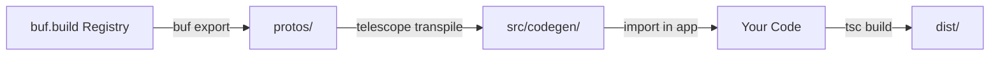

# Complete Step-by-Step Guide: Buf + Telescope Setup (CORRECTED)

**Important**: Telescope is **NOT** available as a Buf remote plugin. This guide uses the correct approach: **Telescope CLI with Buf export**.

---

## Prerequisites Knowledge

Before starting, understand that:

- **Buf** is used to download protos from buf.build registry
- **Telescope** is a Node.js CLI tool that generates TypeScript from protos
- These are **two separate steps**: download protos, then generate code

---

## Step 1: Install Prerequisites and Dependencies

### Install Buf CLI

Choose one method:

```bash
# macOS/Linux (Homebrew)
brew install bufbuild/buf/buf

# Or using npm globally
npm install -g @bufbuild/buf

# Or using pnpm globally
pnpm add -g @bufbuild/buf

# Verify installation
buf --version
```

### Install Telescope CLI

```bash
# Install Telescope as dev dependency
pnpm add -D @hyperweb/telescope
pnpm add -D shelljs glob fast-glob minimatch
```

### Install CosmJS dependencies

```bash
# Install required CosmJS packages
pnpm add @cosmjs/stargate @cosmjs/proto-signing @cosmjs/amino @cosmjs/tendermint-rpc
```

### Install optional helpers

```bash
# For cleaning directories in scripts
pnpm add -D rimraf
```

---

### 3. Create scripts

Add to your `package.json`:

```json
{
  "scripts": {
    "proto:clean": "rm -rf proto",
    "proto:download": "npm run proto:clean && npm run proto:download:lumera && npm run proto:download:deps",
    "proto:download:lumera": "buf export buf.build/lumera-protocol/lumera:c295734a4bed4c689888f309149678f6 -o protos",
    "proto:download:deps": "buf export buf.build/cosmos/cosmos-sdk:5a6ab7bc14314acaa912d5e53aef1c2f -o protos && buf export buf.build/cosmos/cosmos-proto:04467658e59e44bbb22fe568206e1f70 -o protos && buf export buf.build/googleapis/googleapis:004180b77378443887d3b55cabc00384 -o protos",

    "codegen:clean": "rm -rf src/codegen",
    "codegen": "telescope transpile --config .telescope.json",
    "codegen:full": "npm run codegen:clean && npm run proto:refresh && npm run codegen",
    "generate": "npm run codegen:full",
    "generate:watch": "telescope transpile --config .telescope.json --watch"
    }
}
```

**Explanation:**

- `buf export` downloads protos from buf.build
- `buf.build/lumera-protocol/lumera:76f5a5038df84649b0b0557064206d4e` is the module reference (with commit hash for pinning)
- `-o protos` specifies output directory
- `--include-imports` automatically downloads all dependencies (cosmos-sdk, googleapis, etc.)

#### Buf commits

- `76f5a5038df84649b0b0557064206d4e` is the commit for the latest Lumera proto - <https://buf.build/lumera-protocol/lumera/commits>
- `5a6ab7bc14314acaa912d5e53aef1c2f` is the commit for `v0.50.0` - <https://buf.build/cosmos/cosmos-sdk/docs/v0.50.0>
- `04467658e59e44bbb22fe568206e1f70` is the commit for the latest Cosmos proto - <https://buf.build/cosmos/cosmos-proto/docs/main>
- `004180b77378443887d3b55cabc00384` is the commit for the latest Google APIs proto - <https://buf.build/googleapis/googleapis/commits>

---

## Step 4: Download Protos from Buf

```bash
# Download Lumera protos and all dependencies
pnpm run proto:download
```

### Verify downloaded protos

```bash
# Check the protos directory
ls protos/

# You should see folders like:
# - lumera/           (your chain modules)
# - cosmos/           (Cosmos SDK modules)
# - google/           (standard protobuf types)
# - gogoproto/        (if using gogo extensions)
# - cosmos_proto/     (cosmos proto extensions)
```

---

## Step 5: Configure Telescope

Create `.telescope.json` in your project root:

```json
{
  "protoDirs": ["protos"],
  "outPath": "src/codegen",
  "options": {
    "prototypes": {https://buf.build/googleapis/googleapis/commits
      "enabled": true,
      "typingsFormat": {
        "useExact": true
      }
    },
    "aminoEncoding": {
      "enabled": true
    },
    "lcdClients": {
      "enabled": false
    },
    "rpcClients": {
      "enabled": true,
      "camelCase": true
    },
    "stargateClients": {
      "enabled": true,
      "includeCosmosDefaultTypes": true
    },
    "bundle": {
      "enabled": true
    },
    "tsDisable": {
      "disableAll": false
    },
    "eslintDisable": {
      "disableAll": true
    },
    "removeUnusedImports": true,
    "useSDKTypes": true
  }
}
```

**Key Options Explained:**

| Option | Value | Purpose |
| ------ | ----- | ------- |
| `prototypes.enabled` | `true` | Generate TypeScript types and encode/decode functions |
| `aminoEncoding.enabled` | `true` | Generate Amino converters (needed for Ledger support) |
| `rpcClients.enabled` | `true` | Generate RPC query clients (replaces REST/LCD) |
| `stargateClients.enabled` | `true` | Generate registry and Stargate helpers |
| `bundle.enabled` | `true` | Create convenient index files for imports |
| `useSDKTypes` | `true` | Use CosmJS types for better compatibility |

---

---

## Step 6: Generate TypeScript Code

### Run the generation

```bash
# Full generation (download protos + generate code)
pnpm run generate

# Or step by step:
pnpm run proto:download  # Download protos from buf.build
pnpm run codegen         # Generate TypeScript with Telescope
```

### Expected output

You should see:

```bash
🔭 Starting Telescope code generation...
Generating protobuf files...
✨ Telescope code generation complete!
```

---

## Step 7: Verify Generated Code

### Check the structure

```bash
# View generated directories
ls -la src/codegen/

# Should show:
# - lumera/              (your Lumera chain modules)
# - cosmos/              (Cosmos SDK modules)  
# - google/              (standard protobuf types)
# - index.ts             (main exports)
# - client.ts            (Stargate client factory)
# - registry.ts          (message registry)
# - amino.ts             (amino converters)
```

### Inspect key files

```bash
# View main exports
cat src/codegen/index.ts

# View registry exports
cat src/codegen/registry.ts

# View your chain's modules
ls src/codegen/lumera/
```

---

## Step 8: Use Generated Code in Your App

### Create a client file

Create `src/client.ts`:

```typescript
import { SigningStargateClient } from "@cosmjs/stargate";
import { DirectSecp256k1HdWallet } from "@cosmjs/proto-signing";

// Import generated registry and types
import { createRegistry } from "./codegen/registry";
import { createAminoTypes } from "./codegen/amino";

// Import Lumera message types
import { MsgRegisterAction } from "./codegen/lumera/action/v1/v1beta1/tx";

async function main() {
  // Create wallet (replace with your mnemonic)
  const wallet = await DirectSecp256k1HdWallet.fromMnemonic(
    "your mnemonic here...",
    { prefix: "lumera" } // Use your chain's prefix
  );
  
  const [account] = await wallet.getAccounts();
  console.log("Address:", account.address);
  
  // Use generated registry and amino types
  const registry = createRegistry();
  const aminoTypes = createAminoTypes();
  
  // Connect to chain with generated registry
  const client = await SigningStargateClient.connectWithSigner(
    "https://rpc.lumera.network", // Your RPC endpoint
    wallet,
    {
      registry,
      aminoTypes,
    }
  );
  
  // Create message using generated types
  const msg = {
    typeUrl: "/lumera.action.v1.MsgRegisterAction",
    value: MsgRegisterAction.fromPartial({
      creator: account.address,
      // Add your custom fields here
    })
  };
  
  // Sign and broadcast
  const fee = {
    amount: [{ denom: "stake", amount: "5000" }],
    gas: "200000",
  };
  
  const result = await client.signAndBroadcast(
    account.address,
    [msg],
    fee,
    "My custom transaction"
  );
  
  console.log("Transaction hash:", result.transactionHash);
  console.log("Success!");
}

main().catch(console.error);
```

### Create query client example

Create `src/queries.ts`:

```typescript
import { QueryClient } from "@cosmjs/stargate";
import { Tendermint37Client } from "@cosmjs/tendermint-rpc";
import { createProtobufRpcClient } from "@cosmjs/stargate";

// Import generated query clients
import { 
  QueryClientImpl as ActionQueryClient 
} from "./codegen/lumera/action/v1/v1beta1/query";
import { 
  QueryClientImpl as SupernodeQueryClient 
} from "./codegen/lumera/supernode/v1/v1beta1/query";

async function queryExample() {
  // Connect to Tendermint RPC
  const tmClient = await Tendermint37Client.connect(
    "https://rpc.lumera.network"
  );
  
  const queryClient = new QueryClient(tmClient);
  const rpc = createProtobufRpcClient(queryClient);
  
  // Create query clients for your modules
  const actionClient = new ActionQueryClient(rpc);
  const supernodeClient = new SupernodeQueryClient(rpc);
  
  // Query action params
  const actionParams = await actionClient.Params({});
  console.log("Action params:", actionParams);
  
  // Query supernode params
  const supernodeParams = await supernodeClient.Params({});
  console.log("Supernode params:", supernodeParams);
  
  // Query specific action by ID
  const action = await actionClient.Action({ actionId: "your-action-id" });
  console.log("Action:", action);
}

queryExample().catch(console.error);
```

---

## Step 9: Build and Run

### Add build scripts

Update `package.json`:

```json
{
  "scripts": {
    "build": "tsc",
    "start": "node dist/client.js",
    "dev": "ts-node src/client.ts"
  }
}
```

### Build and run

```bash
# Build TypeScript
npm run build

# Run compiled code
npm run start

# Or run directly with ts-node (dev)
npm install -D ts-node
npm run dev
```

---

## Step 10: Project Structure

Your final project structure:

```bash
my-lumera-client/
├── protos/                    # Downloaded protos (gitignore)
│   ├── lumera/
│   ├── cosmos/
│   └── google/
├── src/
│   ├── codegen/              # Generated TypeScript (gitignore)
│   │   ├── lumera/
│   │   ├── cosmos/
│   │   ├── index.ts
│   │   ├── registry.ts
│   │   └── amino.ts
│   ├── client.ts             # Your app code
│   └── queries.ts            # Your query code
├── dist/                     # Compiled output
├── .telescope.json           # Telescope config
├── package.json
├── tsconfig.json
└── .gitignore
```

---

## Step 11: Configure .gitignore

Add to `.gitignore`:

```bash
# Dependencies
node_modules/

# Build output
dist/
*.tsbuildinfo

# Generated code (regenerate via npm run generate)
/protos
/src/codegen

# Environment
.env
.env.local

# IDE
.vscode/
.idea/
*.swp
*.swo
```

**Decision**: Should you commit `src/codegen`?

**Don't commit (recommended for libraries):**

- ✅ Always fresh generation
- ✅ Smaller repo size
- ❌ Requires build step for consumers

**Do commit (recommended for apps):**

- ✅ No build step needed
- ✅ Faster CI builds
- ❌ Larger repo size
- ❌ Merge conflicts on regeneration

---

## Common Commands Reference

```bash
# Download protos from buf.build
npm run proto:download

# Clean downloaded protos
npm run proto:clean

# Refresh protos (clean + download)
npm run proto:refresh

# Generate TypeScript code
npm run codegen

# Clean generated code
npm run codegen:clean

# Full regeneration (refresh protos + generate)
npm run generate

# Watch mode (regenerate on proto changes)
npm run generate:watch

# Build TypeScript
npm run build

# Run your code
npm start
```

---

## Troubleshooting

### Issue: "telescope: command not found"

**Solution:**

```bash
# Install Telescope locally in your project
npm install -D @hyperweb/telescope

# Run via npm/npx
npm run codegen

# Or use npx directly
npx telescope transpile --config .telescope.json
```

### Issue: "No .proto files found"

**Solution:**

```bash
# Ensure protos are downloaded first
npm run proto:download

# Verify protos directory exists and has content
ls -la protos/
ls -la protos/lumera/
```

### Issue: "Module not found" errors in generated code

**Solution:**

```bash
# Ensure all CosmJS dependencies are installed
npm install @cosmjs/stargate @cosmjs/proto-signing @cosmjs/amino @cosmjs/tendermint-rpc

# Clean and regenerate
npm run codegen:clean
npm run generate
```

### Issue: Registry doesn't contain expected message types

**Solution:**

Check your `.telescope.json` configuration:

```json
{
  "options": {
    "prototypes": { "enabled": true },      // ← Must be true
    "stargateClients": { "enabled": true }, // ← Must be true
    "aminoEncoding": { "enabled": true }    // ← Must be true for Ledger
  }
}
```

Then regenerate:

```bash
npm run generate
```

### Issue: "Cannot find module './codegen/registry'"

**Solution:**

```bash
# Generate code first
npm run generate

# Verify codegen directory exists
ls src/codegen/

# Check if registry.ts was generated
cat src/codegen/registry.ts
```

### Issue: TypeScript compilation errors in generated code

**Solution:**

```bash
# Update tsconfig.json to skip lib checks
{
  "compilerOptions": {
    "skipLibCheck": true  // ← Add this
  }
}

# Or exclude codegen from compilation
{
  "exclude": ["node_modules", "src/codegen"]
}
```

---

## Understanding the Workflow



**Step by step:**

1. **Buf export**: Download protos from buf.build to `protos/` directory
2. **Telescope transpile**: Generate TypeScript from `protos/` to `src/codegen/`
3. **Import**: Use generated code in your application
4. **Build**: Compile TypeScript to JavaScript in `dist/`

---

## Advanced: CI/CD Integration

### GitHub Actions example

Create `.github/workflows/ci.yml`:

```yaml
name: CI

on:
  push:
    branches: [main]
  pull_request:
    branches: [main]

jobs:
  test:
    runs-on: ubuntu-latest
    
    steps:
      - uses: actions/checkout@v3
      
      - name: Setup Node.js
        uses: actions/setup-node@v3
        with:
          node-version: '18'
          cache: 'npm'
      
      - name: Install Buf
        run: |
          curl -sSL "https://github.com/bufbuild/buf/releases/download/v1.28.1/buf-$(uname -s)-$(uname -m)" \
            -o /usr/local/bin/buf
          chmod +x /usr/local/bin/buf
      
      - name: Install dependencies
        run: npm ci
      
      - name: Generate protobuf code
        run: npm run generate
      
      - name: Type check
        run: npm run build
      
      - name: Run tests
        run: npm test
```

---

## Best Practices

### 1. Version Pinning

Always pin to specific proto versions:

```json
{
  "scripts": {
    "proto:download": "buf export buf.build/lumera-protocol/lumera:c295734a4bed4c689888f309149678f6 -o protos --include-imports"
  }
}
```

The commit hash ensures reproducible builds.

### 2. Separation of Concerns

Keep generated code separate from your application code:

```bash
src/
├── codegen/          # Generated (don't edit!)
├── blockchain/       # Your blockchain logic
├── cascade/          # Your cascade logic
└── client.ts         # Your main client
```

### 3. Re-exports for Stability

Create stable public API by re-exporting from generated code:

```typescript
// src/index.ts
export { createRegistry } from './codegen/registry';
export { createAminoTypes } from './codegen/amino';
export type { MsgRegisterAction } from './codegen/lumera/action/v1/v1beta1/tx';
```

### 4. Documentation

Document the generation process in your README:

```markdown
## Development

### Generate Code

```bash
# Download protos and generate TypeScript
npm run generate
```

### Build

```bash
npm run build
```

---

## Next Steps

1. ✅ Follow this guide to set up Telescope with Buf
2. ✅ Generate code from your Lumera protos
3. ✅ Integrate generated registry and query clients
4. ✅ Write tests using generated types
5. ✅ Update your documentation

---

## Key Takeaways

✅ **Telescope is a CLI tool**, not a Buf plugin  
✅ Use **two separate steps**: download protos, then generate  
✅ **Pin proto versions** for reproducible builds  
✅ **Don't edit** generated code - regenerate instead  
✅ **Commit your scripts**, not necessarily the generated code  

🚀
