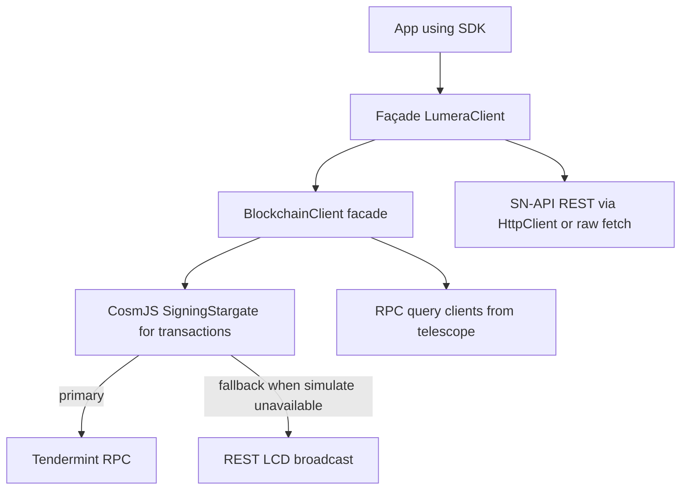

# Lumera SDK JS codebase analysis and recommendations

This report analyzes clarity, dead code, and bad practices with a focus on:

- Ensuring blockchain communication uses RPC generated from protos (`src/codegen`) rather than REST/LCD.
- Avoiding duplication of structures already provided by generated code.
- Highlighting dead code, unclear logic, documentation drift, and testing sync issues.

Scope: SDK internals under `src/`, example/tests under `examples/` and `tests/`, and generated clients under `src/codegen/`.

## Architecture snapshot

The current runtime architecture (inferred from code) is:

Key components:

- RPC queries come from generated QueryClientImpl adapters: [RpcActionQuery()](src/blockchain/client.ts:44), [RpcSupernodeQuery()](src/blockchain/client.ts:141), initialized in [createQueryClients()](src/blockchain/client.ts:189).
- Transactions use CosmJS in [CosmjsTxClient()](src/blockchain/cosmjs.ts:77).
- When gRPC simulation is unavailable, broadcasting falls back to REST in [CosmjsTxClient.signAndBroadcast()](src/blockchain/cosmjs.ts:207) via [broadcastTx()](src/blockchain/rest.ts:36).
- SN-API interactions use a custom client [SNApiClient()](src/cascade/client.ts:76) that mixes `HttpClient` and direct `fetch`.

## Findings and recommendations

### 1) Mixed REST and RPC usage remains in transaction broadcasting

Evidence:

- RPC is correctly used for queries through adapters [RpcActionQuery()](src/blockchain/client.ts:44), [RpcSupernodeQuery()](src/blockchain/client.ts:141).
- Transactions are handled in [CosmjsTxClient.signAndBroadcast()](src/blockchain/cosmjs.ts:207). If `simulate` fails due to type resolution (reflection) the code falls back to REST broadcasting through [broadcastTx()](src/blockchain/rest.ts:36).
- The REST fallback helper is re-exported from the blockchain client module [export broadcastTx](src/blockchain/client.ts:393), making it available beyond the internal fallback path.
- `LumeraClient` requires an LCD URL even when a chain preset is used, enforcing REST configuration in [createLumeraClient()](src/client.ts:250) validation [preset else-branch config check](src/client.ts:266).

Impacts:

- Violates the directive to use only RPC-based communication for node APIs.
- Exposing REST broadcast encourages bypassing RPC workflows.
- Requiring `lcdUrl` as a hard dependency complicates configuration for pure RPC deployments.

Recommendations:

- Make REST broadcasting strictly opt-in or remove it in favor of pure RPC broadcast. If retained, hide the helper (do not export [broadcastTx()](src/blockchain/rest.ts:36)) and gate by an explicit flag.
- Change config validation so `lcdUrl` is optional when REST fallback is disabled; update [createLumeraClient()](src/client.ts:250) and [makeBlockchainClient()](src/blockchain/client.ts:329).
- Update interface documentation to state RPC-only for chain queries and tx lifecycle; fix REST language in [ActionQuery()](src/blockchain/interfaces.ts:218) and [SupernodeQuery()](src/blockchain/interfaces.ts:366).

### 2) Duplicated structures that exist in generated code

Evidence:

- Custom action/supernode types duplicate generated types:
  - Custom public API types in [interfaces.ts](src/blockchain/interfaces.ts) including [ActionState()](src/blockchain/interfaces.ts:167), [ActionType()](src/blockchain/interfaces.ts:181), [ActionRecord()](src/blockchain/interfaces.ts:192) and [SupernodeRecord()](src/blockchain/interfaces.ts:340).
  - Generated models exist under `src/codegen/lumera/...` (e.g., `action/v1/action.ts`, `supernode/v1/super_node.ts`).
- A parallel registry layer:
  - SDK wrapper functions [createRegistry()](src/blockchain/registry.ts:36) and [createAminoTypes()](src/blockchain/registry.ts:61) re-assemble registry and amino from generated exports instead of reusing the generated factory directly. The codegen provides a consolidated factory in [lumera client helper](src/codegen/lumera/client.ts:21).
- A custom conversion pipeline from generated supernode types to SDK interfaces in [convertSupernodeRecord()](src/blockchain/client.ts:101) introduces ongoing maintenance cost and surface for drift.

Impacts:

- API surface duplication creates divergence risk whenever protos change.
- Increases maintenance and review surface without clear added value.
- Confuses users about which types are canonical.

Recommendations:

- Favor generated types as the canonical surface. Where breaking changes would result, add stable type aliases to generated shapes rather than fully distinct interfaces.
- Replace custom registry/amino factories with light re-exports or wrappers that simply forward to the generated factory in [lumera client helper](src/codegen/lumera/client.ts:21).
- Replace manual convertors (e.g., [convertSupernodeRecord()](src/blockchain/client.ts:101)) with thin adapters or use generated models directly in the public API.

### 3) REST query docs/classes are stale while code uses RPC

Evidence:

- Old docs include pages for REST clients: `docs/api/classes/RestActionQuery.html`, `docs/api/classes/RestSupernodeQuery.html`. These pages reference non-existent code lines (e.g., rest.ts lines beyond file length).
- The actual code only exposes [broadcastTx()](src/blockchain/rest.ts:36) and no REST-based module query clients.
- Internal interface comments still mention REST (see [ActionQuery()](src/blockchain/interfaces.ts:218), [SupernodeQuery()](src/blockchain/interfaces.ts:366)).

Impacts:

- Documentation drift confuses users and integrators.
- Suggests patterns (REST query clients) that do not exist in current code.

Recommendations:

- Regenerate API docs from current sources and remove REST query client pages.
- Update interface comments to reflect RPC-only queries.

### 4) Test suite drift: tests reference removed message builder

Evidence:

- Tests import `buildMsgRequestAction` in [cosmjs.test.ts](tests/blockchain/cosmjs.test.ts:164) but this function is absent in [messages.ts](src/blockchain/messages.ts:1).
- The SDK file now encourages generated message composers and no longer provides a builder with that name.

Impacts:

- Failing or skipped tests degrade signal for regressions.
- Sends mixed signals for recommended message-building approach.

Recommendations:

- Migrate tests to use generated composers (e.g., `lumera.action.v1.MessageComposer`) consistently.
- If keeping legacy builders temporarily, reintroduce as thin wrappers marked `@deprecated` that delegate to generated composers to bridge migrations.

### 5) Leaky layering in SN-API client and mixed http usage

Evidence:

- `SNApiClient.startCascade` bypasses `HttpClient` and uses raw `fetch` so it can post `FormData`, accessing `this.http["config"].baseUrl` directly [startCascade()](src/cascade/client.ts:104) [raw fetch](src/cascade/client.ts:142).
- Streaming download also uses raw `fetch` and peeks into private config [downloadFile()](src/cascade/client.ts:271).
- SSE watcher directly constructs URL with private field [watchDownloadTask()](src/cascade/client.ts:317).
- `HttpClient.request` auto-adds JSON content-type whenever `body` exists [request()](src/internal/http.ts:253) [content-type injection](src/internal/http.ts:265), which prevents `FormData` payloads without additional API surface.

Impacts:

- Accessing private internals breaks encapsulation and increases coupling.
- Divergent HTTP pathways (raw `fetch` vs `HttpClient`) duplicate retry, timeout, and header logic.
- Limits portability and observability of HTTP calls.

Recommendations:

- Extend `HttpClient` to support raw bodies without forcing JSON content-type and a streaming download method (response.body passthrough), then route all SN-API calls through it.
- Expose a `resolveUrl` or `baseUrl` getter to avoid peeking into private state.
- Centralize retry/timeout behavior and headers in `HttpClient` for SN-API as well.

### 6) Unclear naming and comments signal legacy REST even when using RPC

Evidence:

- Facade class name contains `Rest`: [CosmjsRestBlockchainClient](src/blockchain/client.ts:213), despite using RPC for queries.
- Interface documentation references REST (see [ActionQuery()](src/blockchain/interfaces.ts:218) and [SupernodeQuery()](src/blockchain/interfaces.ts:366)).

Impacts:

- Signals an outdated design pattern.
- May lead users to expect REST query clients.

Recommendations:

- Rename the facade class to remove `Rest` in a major-version bump and correct documentation immediately.

### 7) Dead code and unused imports

Evidence:

- Stray, unused import from `formdata-node` in blockchain client [orphan import](src/blockchain/client.ts:36).
- Unused import in blockchain client: [base64FromBytes](src/blockchain/client.ts:30).
- Placeholder type file unused in the implementation [snapi.ts](src/types/snapi.ts).

Impacts:

- Confuses readers and linters; suggests incomplete refactors.

Recommendations:

- Remove the stray import and unused symbols.
- Remove the unused placeholder or document its intended replacement.

### 8) BigInt to number coercions and lossy conversions

Evidence:

- Multiple conversions to `number` in supernode mapping [convertSupernodeRecord()](src/blockchain/client.ts:101) (e.g., heights and counts).
- Query adapters return values coerced to strings to match custom `ActionParams` (e.g., `max_raptor_q_symbols` as string) [RpcActionQuery.getParams()](src/blockchain/client.ts:47).

Impacts:

- Potential precision loss for large heights or counters.
- Custom type surface diverges from generated types and may require repeated conversions in downstream code.

Recommendations:

- Prefer generated types and preserve BigInt where it exists in RPC responses. If a string is required for the public API, centralize conversions and document the rationale.

### 9) Public API export surface includes internals that encourage anti-patterns

Evidence:

- Re-export of [broadcastTx()](src/blockchain/client.ts:393) encourages direct REST broadcasting, contrary to RPC-only guidance.

Impacts:

- Codifies the mixed transport pattern in the public API.

Recommendations:

- Stop re-exporting REST broadcasting from the public blockchain module. Keep any fallback strictly internal.

## Prioritized remediation plan

### 1) Remove or strictly gate REST broadcasting

- Make REST fallback opt-in behind an explicit flag; remove [broadcastTx()](src/blockchain/client.ts:393) export.
- Make `lcdUrl` optional when REST fallback is disabled [createLumeraClient()](src/client.ts:250).

### 2) Consolidate on generated types and factories

- Replace custom registry/amino creators with re-exports of the generated factory [lumera client helper](src/codegen/lumera/client.ts:21).
- Migrate public types to generated models; for stability, provide type aliases.

### 3) Update documentation and class/interface names

- Regenerate API docs to remove REST query classes.
- Update interface comments [ActionQuery()](src/blockchain/interfaces.ts:218), [SupernodeQuery()](src/blockchain/interfaces.ts:366).
- Rename [CosmjsRestBlockchainClient](src/blockchain/client.ts:213) in a major release.

### 4) Refactor SN-API HTTP usage

- Extend [HttpClient()](src/internal/http.ts:131) to support FormData and streaming without setting JSON content-type [request()](src/internal/http.ts:253).
- Route SN-API methods through `HttpClient` instead of raw `fetch` [startCascade()](src/cascade/client.ts:104) [downloadFile()](src/cascade/client.ts:271) [watchDownloadTask()](src/cascade/client.ts:317).

### 5) Fix test suite drift

- Replace `buildMsgRequestAction` calls with generated composers in tests [cosmjs.test.ts](tests/blockchain/cosmjs.test.ts:164).

### 6) Code hygiene

- Remove unused imports [client orphans](src/blockchain/client.ts:36) [base64FromBytes](src/blockchain/client.ts:30) and unused placeholder [snapi.ts](src/types/snapi.ts).

## Appendix: evidence index

- RPC queries:
  - [RpcActionQuery()](src/blockchain/client.ts:44), [RpcSupernodeQuery()](src/blockchain/client.ts:141), [createQueryClients()](src/blockchain/client.ts:189)

- Tx lifecycle and REST fallback:
  - [CosmjsTxClient.signAndBroadcast()](src/blockchain/cosmjs.ts:207), [broadcastTx()](src/blockchain/rest.ts:36), [import broadcastTx](src/blockchain/cosmjs.ts:15), [export broadcastTx](src/blockchain/client.ts:393)

- Config requirements:
  - [createLumeraClient()](src/client.ts:250), [preset validation](src/client.ts:266)

- Registry:
  - [createRegistry()](src/blockchain/registry.ts:36), [createAminoTypes()](src/blockchain/registry.ts:61), [lumera client helper](src/codegen/lumera/client.ts:21)

- Interfaces/documentation drift:
  - [ActionQuery()](src/blockchain/interfaces.ts:218), [SupernodeQuery()](src/blockchain/interfaces.ts:366)

- SN-API layering:
  - [SNApiClient.startCascade()](src/cascade/client.ts:104) [raw fetch](src/cascade/client.ts:142)
  - [SNApiClient.downloadFile()](src/cascade/client.ts:271)
  - [SNApiClient.watchDownloadTask()](src/cascade/client.ts:317)
  - [HttpClient()](src/internal/http.ts:131), [request()](src/internal/http.ts:253), [content-type injection](src/internal/http.ts:265)

- Dead/unused:
  - [orphan import](src/blockchain/client.ts:36), [base64FromBytes import](src/blockchain/client.ts:30), [snapi.ts file](src/types/snapi.ts)

- Tests drift:
  - [buildMsgRequestAction usage](tests/blockchain/cosmjs.test.ts:164)

- Stale docs:
  - `docs/api/classes/RestActionQuery.html`, `docs/api/classes/RestSupernodeQuery.html`
