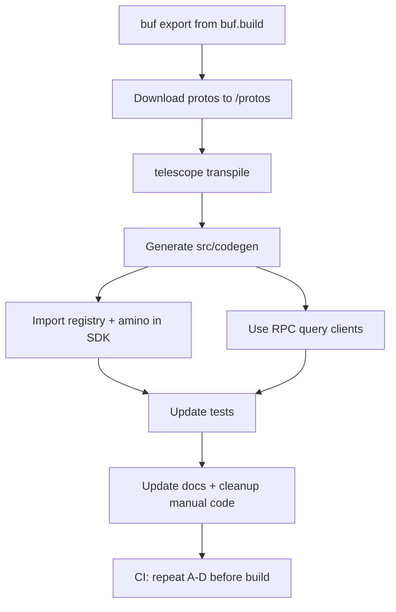

# Refactor lumera-sdk-js to official buf.build protobufs + Telescope codegen

This plan refactors the SDK away from manual protobuf definitions to generated TypeScript code sourced from the official Lumera protos on buf.build. It uses **Telescope CLI with Buf export** to generate TypeScript clients from official protos.

See also the step-by-step operational guide: [docs/Step-by-Step Guide to Buf and Telescope.md](docs/Step-by-Step%20Guide%20to%20Buf%20and%20Telescope.md)

## Objective

Replace all manual protobuf definitions and REST query code in the SDK with officially published protobufs from buf.build and generated TypeScript clients via Telescope. Outcomes:

- Types, Amino converters, registry entries, message composers, and RPC query clients generated into `src/codegen` from official Lumera protos.
- Signing flows use a generated Stargate registry and Amino converters (no hand-rolled mappings).
- REST-based query clients replaced with generated RPC clients.
- Generation is reproducible and pinned; one command (pnpm script) produces a fresh tree.

## Target State

- Proto source: Lumera protos from buf.build, exported locally via `buf export`
- Codegen tool: Telescope CLI with programmatic or config-based generation
- Generated outputs live in `src/codegen` and are imported from SDK internals
- All manual proto/registry code removed or reduced to thin re-exports to generated code
- CI performs codegen in a deterministic manner, pinned to a known Lumera module version/commit

## Scope and Guardrails

- Only replace the blockchain integration layer; do not alter unrelated business logic
- Maintain public API where feasible; document necessary changes in [MIGRATION.md](MIGRATION.md)
- Codegen must be deterministic and CI-friendly (pinned dependencies, consistent outputs)

---

## Codegen Workflow: Telescope CLI with Buf Export

**Note**: Telescope is NOT available as a Buf remote plugin. The correct approach is to:

1. Use `buf export` to download protos locally
2. Run Telescope CLI to generate TypeScript code from the exported protos

---

## 1) Setup and Installation

### 1.1 Install prerequisites

Install required tools:

```bash
# Install Buf CLI (choose one method)
# macOS/Linux (Homebrew):
brew install bufbuild/buf/buf

# Or using npm/pnpm globally:
pnpm add -g @bufbuild/buf

# Verify Buf installation
buf --version
```

Install Telescope and dependencies:

```bash
# Install Telescope CLI and helpers
pnpm add -D @hyperweb/telescope
pnpm add -D shelljs glob fast-glob minimatch

# Install CosmJS runtime deps
pnpm add @cosmjs/stargate @cosmjs/proto-signing @cosmjs/amino @cosmjs/tendermint-rpc

# Install additional helpers if needed
pnpm add -D rimraf
```

### 1.2 Project structure

Your project will have:

```bash
lumera-sdk-js/
├── protos/                    # Downloaded protos (from buf export)
├── src/
│   ├── codegen/              # Generated TypeScript (from Telescope)
│   ├── blockchain/
│   ├── cascade/
│   └── ...
├── .telescope.json           # Telescope configuration
├── package.json
└── tsconfig.json
```

### 1.3 Create scripts

Add to your `package.json`:

```json
{
  "scripts": {
    "proto:clean": "rm -rf proto",
    "proto:download": "npm run proto:clean && npm run proto:download:lumera && npm run proto:download:deps",
    "proto:download:lumera": "buf export buf.build/lumera-protocol/lumera:c295734a4bed4c689888f309149678f6 -o protos",
    "proto:download:deps": "buf export buf.build/cosmos/cosmos-sdk:5a6ab7bc14314acaa912d5e53aef1c2f -o protos && buf export buf.build/cosmos/cosmos-proto:04467658e59e44bbb22fe568206e1f70 -o protos && buf export buf.build/googleapis/googleapis:61b203b9a9164be9a834f58c37be6f62 -o protos",

    "codegen:clean": "rm -rf src/codegen",
    "codegen": "telescope transpile --config .telescope.json",
    "codegen:full": "npm run codegen:clean && npm run proto:refresh && npm run codegen",
    "generate": "npm run codegen:full",
    "generate:watch": "telescope transpile --config .telescope.json --watch"
    }
}
```

---

## 2) Download Protos from Buf

```bash
# Download Lumera protos and all dependencies
pnpm run proto:download
```

This creates a `protos/` directory with:

- `lumera/` - Your chain modules
- `cosmos/` - Cosmos SDK modules  
- `google/` - Standard protobuf types
- `gogoproto/` - Gogo protobuf extensions (if needed)
- `cosmos_proto/` - Cosmos proto extensions

**Important**: The `--include-imports` flag automatically fetches all transitive dependencies (cosmos-sdk, googleapis, etc.), so you don't need to download them separately!

---

## 3) Configure Telescope

Create `.telescope.json` at repo root:

```json
{
  "protoDirs": ["protos"],
  "outPath": "src/codegen",
  "options": {
    "prototypes": {
      "enabled": true,
      "typingsFormat": {
        "useExact": true
      }
    },
    "aminoEncoding": {
      "enabled": true
    },
    "lcdClients": {
      "enabled": false
    },
    "rpcClients": {
      "enabled": true,
      "camelCase": true
    },
    "stargateClients": {
      "enabled": true,
      "includeCosmosDefaultTypes": true
    },
    "bundle": {
      "enabled": true
    },
    "tsDisable": {
      "disableAll": false
    },
    "eslintDisable": {
      "disableAll": true
    },
    "removeUnusedImports": true,
    "useSDKTypes": true
  }
}
```

**Key options explained**:

- `prototypes.enabled`: Generate TypeScript types and encode/decode helpers
- `aminoEncoding.enabled`: Generate Amino converters (for Ledger support)
- `rpcClients.enabled`: Generate RPC query clients (replaces REST)
- `stargateClients.enabled`: Generate registry and Stargate integration helpers
- `bundle.enabled`: Bundle all exports into convenient index files
- `useSDKTypes`: Use CosmJS SDK types for compatibility

---

## 4) Generate TypeScript Code

### Run generation

```bash
# Full regeneration (download protos + generate code)
pnpm run generate

# Or step by step:
pnpm run proto:download  # Download protos from buf.build
pnpm run codegen         # Generate TypeScript with Telescope
```

### Verify generated code

```bash
# Check the generated structure
ls -la src/codegen/

# You should see:
# - lumera/              (your chain modules)
# - cosmos/              (Cosmos SDK modules)
# - google/              (standard protobuf types)
# - index.ts             (main exports)
# - client.ts            (Stargate client helpers)
# - registry.ts          (message registry)
# - amino.ts             (amino converters)
```

---

## 5) SDK Integration

Replace all manual protobuf wiring with generated outputs.

### 5.1 Registry and Amino integration

**Files to refactor:**

- `src/blockchain/registry.ts`
- `src/blockchain/messages.ts`

**Plan:**

1. Import generated helpers:

```typescript
// src/blockchain/registry.ts
import { createRegistry } from '../codegen';
import { createAminoTypes } from '../codegen/amino';

// Create registry with all Lumera + Cosmos types
export const registry = createRegistry();

// Create amino types for Ledger support
export const aminoTypes = createAminoTypes();
```

2. Remove all manual `typeUrl` mappings and Amino encoders/decoders

3. Export consolidated registry and amino types for use in signing clients

### 5.2 Transaction signing client

**Files to refactor:**

- `src/blockchain/cosmjs.ts`
- `src/blockchain/client.ts`

**Plan:**

Update `SigningStargateClient` initialization to use generated registry and amino:

```typescript
import { SigningStargateClient } from '@cosmjs/stargate';
import { registry, aminoTypes } from './registry';

export async function createSigningClient(
  rpcEndpoint: string,
  signer: OfflineSigner
): Promise<SigningStargateClient> {
  return SigningStargateClient.connectWithSigner(
    rpcEndpoint,
    signer,
    {
      registry,
      aminoTypes,
      // ... other options
    }
  );
}
```

Use generated message composers:

```typescript
// Import from generated code
import { lumera } from '../codegen';

// Use message composer
const msg = lumera.action.v1beta1.MessageComposer.withTypeUrl.registerAction({
  creator: address,
  // ... fields
});

// Or construct manually with generated types
const msg = {
  typeUrl: '/lumera.action.v1beta1.MsgRegisterAction',
  value: MsgRegisterAction.fromPartial({
    creator: address,
    // ... fields
  })
};
```

### 5.3 Replace REST queries with RPC query clients

**Files to refactor:**

- `src/blockchain/rest.ts`
- `src/blockchain/client.ts`

**Plan:**

1. Create RPC query client setup:

```typescript
import { QueryClient } from '@cosmjs/stargate';
import { Tendermint37Client } from '@cosmjs/tendermint-rpc';
import { createProtobufRpcClient } from '@cosmjs/stargate';

// Import generated query clients
import { 
  QueryClientImpl as ActionQueryClient 
} from '../codegen/lumera/action/v1beta1/query';
import { 
  QueryClientImpl as SupernodeQueryClient 
} from '../codegen/lumera/supernode/v1beta1/query';

export async function createQueryClients(rpcEndpoint: string) {
  // Connect to Tendermint RPC
  const tmClient = await Tendermint37Client.connect(rpcEndpoint);
  const queryClient = new QueryClient(tmClient);
  
  // Create protobuf RPC client
  const rpc = createProtobufRpcClient(queryClient);
  
  // Instantiate generated query clients
  return {
    action: new ActionQueryClient(rpc),
    supernode: new SupernodeQueryClient(rpc),
  };
}
```

2. Use generated query clients:

```typescript
// Old REST approach (REMOVE):
const response = await fetch(`${lcdEndpoint}/lumera/action/v1beta1/params`);
const data = await response.json();

// New RPC approach (USE):
const clients = await createQueryClients(rpcEndpoint);
const params = await clients.action.Params({});
```

3. Replace all REST calls with RPC equivalents

### 5.4 Public API compatibility

If the SDK currently exposes message-building or query helpers:

1. Add thin wrapper functions that delegate to generated code:

```typescript
// src/blockchain/messages.ts
import { lumera } from '../codegen';

// Wrapper for backward compatibility
export function buildRegisterActionMsg(params: {
  creator: string;
  // ... other fields
}) {
  return lumera.action.v1beta1.MessageComposer.withTypeUrl.registerAction(params);
}
```

2. Mark old APIs as deprecated in JSDoc:

```typescript
/**
 * @deprecated Use generated message composers from codegen instead
 * Will be removed in v2.0.0
 */
export function oldMessageBuilder() {
  // ...
}
```

---

## 6) Testing and Validation

### 6.1 Update existing tests

**Files to update:**

- `tests/blockchain/registry.test.ts`
- `tests/blockchain/cosmjs.test.ts`
- `tests/blockchain/rest.test.ts` (migrate to RPC)

**Test checklist:**

- ✅ Generated registry contains Lumera message types
- ✅ Transactions sign and broadcast using generated types
- ✅ RPC query clients return expected data structures
- ✅ Amino encoding works (test with Ledger if available)
- ✅ Message composers create valid messages

### 6.2 Update examples

**Files to update:**

- `examples/browser/main.ts`
- `examples/node/full-workflow.ts`
- `examples/node/lumera-client-demo.ts`

Update examples to use generated code:

```typescript
import { createRegistry } from '../src/codegen';
import { lumera } from '../src/codegen';

// Use generated types and helpers
const registry = createRegistry();
const msg = lumera.action.v1beta1.MessageComposer.withTypeUrl.registerAction({
  // ...
});
```

---

## 7) Documentation

### 7.1 Update MIGRATION.md

Document the changes for existing users:

```markdown
## Migrating to Generated Protobuf Code

### Registry Changes
- **Old**: Manual registry setup
- **New**: Use `createRegistry()` from `src/codegen`

### Message Building
- **Old**: Manual message construction
- **New**: Use generated message composers from `lumera.*.MessageComposer`

### Queries
- **Old**: REST/LCD endpoints
- **New**: RPC query clients from `src/codegen`

### Example Migration

**Before:**
\`\`\`typescript
const registry = new Registry();
registry.register('/lumera.action.MsgRegisterAction', MsgRegisterAction);
\`\`\`

**After:**
\`\`\`typescript
import { createRegistry } from '@lumera/sdk-js';
const registry = createRegistry();
\`\`\`
```

### 7.2 Update API documentation

- Regenerate TypeDoc documentation
- Add examples using generated code
- Document all exported types and helpers

---

## 8) Cleanup

After integration is proven and tested:

### 8.1 Remove manual implementations

**Files to delete or minimize:**

- `src/blockchain/prototypes.ts` (manual proto definitions)
- `src/blockchain/messages.ts` (if fully replaced by generated composers)
- Manual registry code in `src/blockchain/registry.ts` (reduce to re-exports)

**Files to update:**

- `src/blockchain/rest.ts` (remove REST query implementations)
- `src/blockchain/client.ts` (remove REST-based query methods)
- `src/index.ts` (update exports to use generated code)

### 8.2 Update .gitignore

Add to `.gitignore`:

```bash
# Downloaded protos (regenerate via buf export)
/protos

# Generated code (regenerate via telescope)
/src/codegen
```

**Note**: Some teams commit `src/codegen` for library distribution. Decide based on your needs:

- **Commit codegen**: Consumers don't need to run generation
- **Don't commit**: Ensures fresh generation, but requires build step

---

## 9) CI/CD and Reproducibility

### 9.1 CI workflow

Add to your CI pipeline (e.g., `.github/workflows/ci.yml`):

```yaml
jobs:
  test:
    runs-on: ubuntu-latest
    steps:
      - uses: actions/checkout@v3
      
      - name: Install dependencies
        run: pnpm install
      
      - name: Generate protobuf code
        run: pnpm run generate
      
      - name: Run tests
        run: pnpm test
      
      - name: Build
        run: pnpm build
```

### 9.2 Version pinning

Pin to specific Lumera proto versions in package.json scripts:

```json
{
  "scripts": {
    "proto:download": "buf export buf.build/lumera-protocol/lumera:c295734a4bed4c689888f309149678f6 -o protos --include-imports"
  }
}
```

The commit hash `c295734a4bed4c689888f309149678f6` ensures reproducible builds. Update intentionally when upgrading.

---

## 10) Risk Management and Rollout

### Phase 1: Parallel Implementation

- Add generated code alongside manual code
- Write comparison tests to verify encoding matches
- Keep manual code as fallback

### Phase 2: Migration

- Switch signing and queries to generated code
- Add feature flags for temporary rollback if needed
- Monitor for issues

### Phase 3: Cleanup

- Remove manual code after successful migration
- Update all documentation
- Release new version (minor or major based on breaking changes)

---

## 11) Concrete Action Checklist

### Initial Setup

- [ ] Install Buf CLI
- [ ] Install Telescope CLI (`@hyperweb/telescope`)
- [ ] Install CosmJS dependencies
- [ ] Create `.telescope.json` configuration file
- [ ] Add generation scripts to `package.json`

### Proto Download

- [ ] Run `pnpm run proto:download` to fetch Lumera protos
- [ ] Verify `protos/` directory contains lumera, cosmos, google folders
- [ ] Commit proto download script (not the protos themselves)

### Code Generation

- [ ] Run `pnpm run codegen` to generate TypeScript
- [ ] Verify `src/codegen` contains expected structure
- [ ] Inspect generated registry, amino, and query client files
- [ ] Test imports in a simple script

### SDK Refactor

- [ ] Replace `src/blockchain/registry.ts` with generated registry
- [ ] Update `src/blockchain/cosmjs.ts` to use generated registry/amino
- [ ] Replace REST queries in `src/blockchain/rest.ts` with RPC clients
- [ ] Update message builders to use generated composers
- [ ] Update exports in `src/index.ts`

### Testing

- [ ] Update registry tests
- [ ] Update transaction signing tests
- [ ] Migrate REST query tests to RPC
- [ ] Test examples (browser and Node)
- [ ] Verify Ledger support (amino encoding)

### Documentation

- [ ] Update MIGRATION.md with changes
- [ ] Update README with new usage examples
- [ ] Regenerate API documentation
- [ ] Document codegen workflow in CONTRIBUTING.md

### Cleanup

- [ ] Remove manual protobuf definitions
- [ ] Remove obsolete REST query code
- [ ] Update .gitignore
- [ ] Remove unused dependencies

### CI/CD

- [ ] Add codegen step to CI pipeline
- [ ] Test full CI build
- [ ] Set up proto version pinning strategy
- [ ] Document release process

---

## 12) Workflow Overview



---

## 13) Troubleshooting

### Issue: "telescope: command not found"

```bash
# Install Telescope locally in project
pnpm add -D @hyperweb/telescope

# Run via pnpm/npx
pnpm telescope transpile --config .telescope.json
```

### Issue: "No .proto files found"

```bash
# Ensure protos are downloaded first
pnpm run proto:download

# Verify protos directory exists
ls protos/
```

### Issue: Generated code has import errors

```bash
# Clean and regenerate
pnpm run codegen:clean
pnpm run generate

# Ensure all CosmJS dependencies are installed
pnpm install
```

### Issue: Registry missing message types

```bash
# Check Telescope config - ensure these are enabled:
# - prototypes: true
# - stargateClients: true
# - aminoEncoding: true

# Regenerate with correct config
pnpm run generate
```

---

## 14) Browser Bundling Considerations

- Generated code is ESM-friendly and tree-shakeable
- Long integer handling via `long.js` is included in CosmJS
- No Node.js-specific dependencies in generated code
- If using RPC clients in browser, ensure:
  - Fetch API available (modern browsers)
  - WebSocket support for Tendermint RPC subscriptions
  - No Node.js stream polyfills needed
